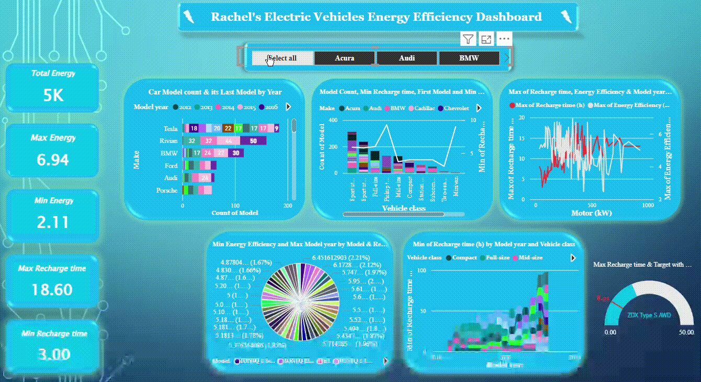

# Data-Science-Intern-NeoZeno
## Training Projects

### Demo video of Electric Vehicle Energy Efficiency Power BI Dashboard project

### 1) Students Performance Analysis
This project presents an end-to-end analysis of student exam performance using SQL, Python, and R.
It explores academic, demographic, and lifestyle factors influencing exam scores and converts raw data into actionable insights.

#### Project Workflow Pipeline

**Data Ingestion**
- Loaded student performance data from CSV into SQL, Python, and R environments.

**Data Validation (SQL)**
- Checked for missing values and ensured data consistency across all academic and lifestyle features.

**Exploratory Data Analysis (SQL)**
- Analyzed performance patterns by course, gender, exam difficulty, and score ranges.

**Rule-Based Prediction (Python)**
- Classified students into Top, Average, and Poor performers using transparent score-based rules.

**Data Visualization (R)**
- Created visual insights to validate relationships between study habits, attendance, sleep, and exam scores.

#### Key Insights – Student Performance Analysis

- Class attendance and study consistency are the strongest predictors of high exam scores.
- Sleep quality impacts performance more than sleep duration, highlighting the importance of healthy routines.
- Structured study methods correlate with higher and more stable academic outcomes.
- Exam difficulty and course structure influence score distribution, affecting performance variability.
- Access to internet and quality facilities indirectly support better academic results.
- Performance trends remain balanced across genders, indicating fair academic outcomes.
- Rule-based classification effectively identifies top performers and at-risk students, enabling early intervention.

### Creating Professional Dashboard using Power BI for Electric Vehicle Energy Efficiency Analysis
This project presents an interactive Power BI dashboard to analyze the energy efficiency of electric vehicles (EVs) across different manufacturers, vehicle classes, and model years. The dashboard helps compare older vs newer EV models and understand how factors such as motor power, recharge time, and manufacturing year impact overall efficiency.

#### Analysis & Visualizations

The dashboard includes multiple visual elements to deliver actionable insights:

- KPI Cards – Total, minimum, and maximum energy efficiency and recharge time

- Stacked Bar Chart – Manufacturer-wise vehicle model count and latest model year

- Line & Stacked Column Chart – Model count, minimum recharge time, and first manufactured year by manufacturer

- Line Chart – Maximum recharge time and energy efficiency by motor power (kW)

- Pie Chart – Energy efficiency distribution across models and recharge times

- Ribbon Chart – Recharge time trends by model year and vehicle class

- Gauge Chart – Maximum recharge time vs target efficiency

**Target Calculation:**
Target = Average Energy Efficiency × 2

#### Key Insights

- Wide efficiency range observed across EVs, with energy efficiency spanning from ~2.1 to ~6.9 km/kWh, highlighting significant performance differences by model, motor power, and manufacturing year.

- Newer EV models demonstrate improved energy efficiency, indicating continuous advancements in battery technology and motor optimization over recent model years.

- Higher motor power (kW) does not always translate to higher efficiency, revealing trade-offs between performance and energy consumption.

- Recharge time varies substantially across vehicle classes, with compact vehicles generally achieving faster minimum recharge times compared to full-size and mid-size EVs.

- Manufacturers like Tesla, Rivian, and BMW dominate model counts, reflecting aggressive innovation and frequent model refresh cycles in the EV market.

- Certain vehicle classes show consistent reductions in recharge time over years, signaling improvements in charging infrastructure compatibility and battery design.

- Energy efficiency peaks at specific motor ranges, suggesting an optimal balance point between motor capacity and energy usage.

- Model-year trends reveal rapid growth post-2020, aligning with global EV adoption and regulatory pushes toward sustainable mobility.

- Gauge analysis highlights models exceeding efficiency targets, making strong candidates for eco-conscious consumers and fleet optimization.
